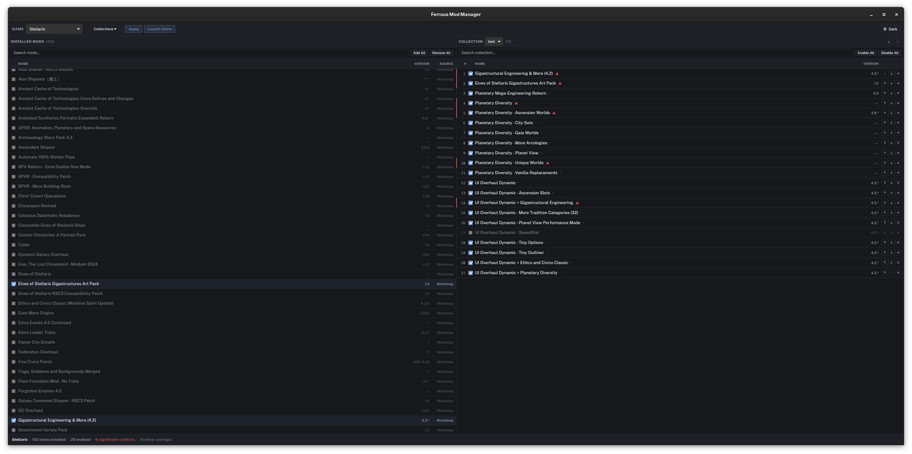
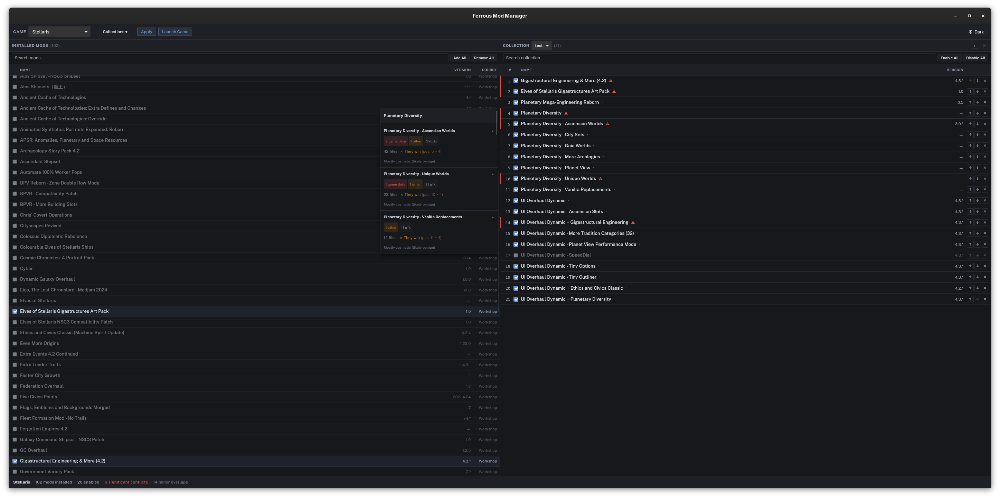

# Ferrous Mod Manager

A native Linux mod manager for Paradox Interactive games, built with Rust and Tauri.

## Supported Games

| Game | Status |
|------|--------|
| Stellaris | Confirmed Working |
| Europa Universalis IV | Needs Testing |
| Hearts of Iron IV | Needs Testing |
| Crusader Kings III | Needs Testing |
| Victoria 3 | Needs Testing |
| Imperator: Rome | Needs Testing |
| Star Trek: Infinite | Needs Testing |

## Screenshots





## Installation

### From Source

#### Prerequisites

- [Rust](https://rustup.rs/) (stable toolchain)
- [Node.js](https://nodejs.org/) (v18+)
- [Tauri prerequisites for Linux](https://v2.tauri.app/start/prerequisites/#linux):
- Steam (for game detection and launching)

#### Build & Run

```bash
# Clone the repo
git clone https://github.com/terry-c-8512352/ferrous-mod-manager.git
cd ferrous-mod-manager

# Install frontend dependencies
cd ui && npm install && cd ..

# Run in dev mode
WEBKIT_DISABLE_DMABUF_RENDERER=1 cargo tauri dev

# Build for release
cargo tauri build
```

> **Note:** The `WEBKIT_DISABLE_DMABUF_RENDERER=1` env var is needed on some Wayland systems to prevent rendering issues.

#### Run Tests

```bash
# Rust tests
cargo test

# Lint
cargo clippy

# Format check
cargo fmt -- --check
```

## Architecture

| Layer | Language | Role |
|-------|----------|------|
| Core library | Rust (`src/`) | Game detection, mod parsing, conflict analysis, load order I/O |
| Tauri shell | Rust (`src-tauri/`) | Desktop window, IPC bridge between core and frontend |
| UI | Svelte + TypeScript (`ui/`) | Mod lists, drag-and-drop ordering, conflict visualization |

## Contributing

Looking for some contributors to help maintain this project :)
